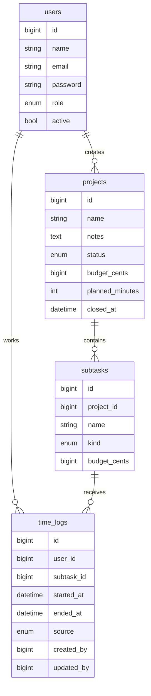

# Project time pilot — technical specification

Version 1.0. This is the build contract for the pilot quoted at 120 hours. The client tests this version, then changes are quoted again.

Working UI name: **Controle de projetos**.

## 1. What this version is

A responsive web app on the client's domain. People at a plastics plant log shop time against project subtasks, and leaders keep a budget in Brazilian reais next to a planned number of hours.

Three roles:

| Role | Job in this version |
|---|---|
| Admin | Users, projects, subtasks, every time log, reports. |
| Leader | Projects, subtasks, every time log. No reports, no user admin. |
| Operator | Start and stop their own timer. Add an internal subtask. |

One company, one site. Interface in Brazilian Portuguese. Money in BRL. Clock and calendar in `America/Sao_Paulo`.

## 2. Stack

| Layer | Choice |
|---|---|
| App | Laravel 13, PHP 8.4 (o módulo que o Apache desta máquina já carrega) |
| UI | Blade e CSS próprio em `public/css`. Sem Node e sem Tailwind no piloto, para o Apache servir o app sem etapa de build |
| Database | MySQL já instalado na máquina (aqui é o 9; o driver do Laravel fala com 8 e 9) |
| Sessions | Driver `database` |
| Local | Apache 2.4 desta máquina, virtual host com `DocumentRoot` em `public/`. Sem Docker |
| Produção | O mesmo arranjo: Apache, PHP 8.4, MySQL, HTTPS no domínio do cliente |

O `php` do PATH nesta máquina pode ser 8.5. Artisan, Composer e testes usam o binário do PHP 8.4, o mesmo major que o Apache executa.

HTML renderizado no servidor é requisito. As telas do operador são views separadas. Essas views não recebem orçamento, horas previstas, totais lançados, custo-hora nem o ponto de outra pessoa. Esconder coluna com CSS não atende esta spec.

Sem SPA, sem API pública, sem websockets, sem Redis, sem filas. O piloto não precisa disso.

Idioma: interface, validação e comentários de código em português. Nomes de classes, métodos, colunas e variáveis ficam em inglês, alinhados ao Laravel e a este modelo de dados. Rotas públicas ficam em português, como na seção 11.

## 3. Out of scope

Leave these out of the codebase, including as unused tables:

- Offline or flaky-network clock
- Hourly labor rate, and any formula that turns hours into reais
- Assigning an operator to a project
- Approval of time logs
- Email, password-reset mail, WhatsApp, push
- Machines, molds, maintenance, inventory
- Native apps
- More than one company or plant
- A second language
- Audit log beyond `created_by` / `updated_by` on time logs
- Self-registration and a profile screen

Hosting is the client's account. This spec includes putting the app on their server. It does not include the monthly server bill.

## 4. Access

Session login with email and password. No public signup.

Admin creates every user and sets the password. Minimum password length is 8 characters. Email is unique. A user is `active` or not. An inactive user cannot log in.

Deactivating a user who has an open timer stops that timer at the server's current time and records the admin as `updated_by`.

Logout does not stop a timer. The open row stays open until someone stops it. Session lifetime is 12 hours so a shift does not expire mid-job. When the operator signs in again, the open timer is still there.

There is no "forgot password" flow. The admin sets a new password.

Seed the pilot with one admin, one leader, two operators, two open projects, one closed project, a mix of internal and third-party subtasks, a handful of finished logs, and one timer left running.

## 5. Data model

Store money as integer cents. Store durations as timestamps and compute minutes in queries. Never store a float for reais or hours.

### users

| Column | Rules |
|---|---|
| `name` | Required, 2–120 characters |
| `email` | Required, unique, used as login |
| `password` | Hashed |
| `role` | `admin`, `leader`, or `operator` |
| `active` | Default true |

### projects

| Column | Rules |
|---|---|
| `name` | Required, 2–160 characters |
| `notes` | Optional, max 2000 characters |
| `status` | `open` or `closed`. Default `open` |
| `budget_cents` | Required, integer, ≥ 0. This is the project budget. It is not a sum of anything else. |
| `planned_minutes` | Required, integer, ≥ 0. Planned shop time for the whole project. |
| `closed_at` | Set when status becomes `closed`. Cleared on reopen. |
| `created_by` | User id |

Closing keeps every subtask and every log. A closed project accepts no new subtasks and no new logs.

Delete a project only when it has no time logs. Otherwise the only exit is close. Same rule for subtasks: delete only when that subtask has no logs.

### subtasks

| Column | Rules |
|---|---|
| `project_id` | Required. Project must be open to create. |
| `name` | Required, 2–160 characters. Duplicates are allowed. |
| `kind` | `internal` or `third_party` |
| `budget_cents` | Required and ≥ 0 when `kind` is `third_party`. Null when `kind` is `internal`. |
| `created_by` | User id |

An internal subtask is what people clock. A third-party subtask is a budget line for an outside crew. It never receives a time log. Changing `kind` after logs exist is rejected. Changing a third-party subtask to internal is allowed only while it has no logs.

Operators may create subtasks. The server forces `kind = internal` and `budget_cents = null` on that path. The operator form has a name field and nothing else.

### time_logs

| Column | Rules |
|---|---|
| `user_id` | The person whose time it is |
| `subtask_id` | Must be an internal subtask on an open project at the moment of create |
| `started_at`, `ended_at` | Stored in UTC. `ended_at` null means the timer is open. When both are set, `ended_at` is after `started_at`. |
| `source` | `timer` or `manual` |
| `created_by`, `updated_by` | Who wrote the row. For an operator timer these are the operator. For a manual row these are the leader or admin. |

Database constraints:

- At most one open log per user. Partial unique index on `user_id` where `ended_at` is null.
- Application check: no two logs for the same user overlap. Intervals are `[started_at, ended_at)`. An open log runs until it is stopped, so it overlaps any other interval that ends after its `started_at`. Two different users on the same subtask is normal and must be allowed.

Overlap is checked on create and on update, ignoring the row being edited.

`source` does not change after insert. Editing a timer row keeps `source = timer`.

Duration in minutes is `TIMESTAMPDIFF(MINUTE, started_at, ended_at)`. Open logs are excluded from every total.

## 6. Permissions

Enforce these on the server for every route, not only in the navigation. A forbidden URL returns 403.

| Action | Admin | Leader | Operator |
|---|---|---|---|
| Sign in | Yes | Yes | Yes |
| Manage users | Yes | No | No |
| Open reports and CSV | Yes | No | No |
| Create, edit, close, reopen projects | Yes | Yes | No |
| Delete a project that has no logs | Yes | Yes | No |
| See budgets, planned hours, logged totals | Yes | Yes | No |
| Create a third-party subtask | Yes | Yes | No |
| Edit or delete a subtask | Yes | Yes | No |
| Create an internal subtask | Yes | Yes | Yes |
| Start and stop their own timer | Yes | Yes | Yes |
| See every open timer | Yes | Yes | Own timer only |
| Create, edit, delete any time log | Yes | Yes | No |
| List historical logs | Yes | Yes | No |

Any active user may clock any internal subtask of any open project. There is no assignment table.

Operator HTTP responses, including validation errors, must not echo a budget, a planned-hour figure, a summed duration, or another person's name on a timer.

## 7. Time rules

Server time is the only clock that writes `started_at` for a timer. The browser clock is never stored.

**Start.** `POST` with a subtask id.

- Caller is authenticated and active.
- Subtask is internal and its project is open.
- Caller has no open log.
- Insert `started_at = now()`, `ended_at = null`, `source = timer`.

If they already have an open log, refuse and point them at that log. If the subtask is third-party or the project is closed, refuse.

**Stop.** Stops the caller's open log. Set `ended_at = now()`. If `ended_at` is not after `started_at`, refuse. If they have no open log, refuse.

Operators have no other time-log actions. They never send a start time, an end time, or a duration.

**Manual log.** Leaders and admin.

- Required: user, internal subtask, start, end.
- The project must be open.
- End is after start.
- End is not in the future. Start may be in the past.
- The interval does not overlap another log of that same user.
- `source = manual`.

Edit uses the same checks. Delete is a hard delete. The pilot has no trash.

Leaders and admin may also start and stop their own timer. Manual entry is how they fix an operator's day.

## 8. Screens

Navigation shows only the links that role can open.

Phone layout is a single column below 768px. The operator's open timer, when they have one, stays at the top of the home screen with a full-width **Parar** button. Admin tables scroll sideways on a phone. That is enough. The clock flow is the one that has to feel obvious on a phone.

### Entrar

Email, password, submit. Generic error on failure: "E-mail ou senha inválidos."

### Início

Two regions.

**Left — Projetos em andamento.** Open projects only.

- Admin and leader see, per project: name, budget, planned hours, hours logged so far (all finished logs, not date-filtered), and the sum of third-party subtask budgets. Each row links to the project.
- Operator sees the project name only. The row links to a start screen for that project.

**Right — Pontos em andamento.**

- Admin and leader see every open log: operator name, project, subtask, time of day it started, and a live elapsed counter driven from `started_at` in the page. Refreshing the page is enough if the script does not run. This region can be empty: "Nenhum ponto em andamento."
- Operator sees their own open log only: project, subtask, "Desde HH:MM", and **Parar**. No elapsed counter, no history, no other people. If they have nothing open: "Você não tem ponto em andamento."

### Projetos

Admin and leader. List with a status filter, default **Abertos**. Columns: name, status, budget, planned hours, logged hours, third-party budget sum.

Create and edit form:

- Nome
- Observações
- Orçamento (R$), input with Brazilian grouping, stored as cents
- Horas previstas, decimal hours typed with a comma or a dot (`1,5` and `1.5` both mean 90 minutes), stored as minutes, rounded to the nearest minute
- Salvar

Actions on a row: edit, close, reopen, and delete when there are no logs.

Operators have no project list route. They reach open projects from Início.

### Projeto

Admin and leader see the project header with the same figures as the list, then two groups of subtasks.

Internal subtasks: name, logged hours, a control to edit or delete when the subtask has no logs. Delete is hidden when logs exist.

Third-party subtasks: name, budget, edit, delete when unused.

**Nova subtarefa** for these roles asks for name, type (Interna / Equipe terceira), and budget when the type is third-party.

Operator project screen, reached from Início: project name as a heading, then internal subtasks, each with **Iniciar**. Third-party rows are omitted. No hours, no money. At the bottom, a single field **Nova subtarefa** and a save button. If this operator already has an open timer, **Iniciar** is not shown; a line tells them to stop the current point first.

### Lançamentos

Admin and leader. Filter by project, user, and a date range on `started_at`. Default range is the current month in São Paulo.

Columns: operator, project, subtask, start, end, duration as `Hh MMmin`, source (Ponto / Manual).

**Novo lançamento** and edit use the manual rules in section 7. Delete asks for a confirm.

Open logs appear in this list with end shown as "Em andamento" and no duration. A leader can edit one to set an end, which closes it, or delete it.

### Relatórios

Admin only. One page, two blocks, one date range. Default is the current month, interpreted in São Paulo, inclusive of both dates.

A log is inside the range when its `started_at` falls on those dates in São Paulo. Open logs are left out. The page says so: "Pontos em andamento não entram na soma."

**Por projeto.** One row per project that is open, closed, or has logs in range. Columns:

- Projeto
- Status
- Orçamento (R$) — the stored project budget, not filtered by date
- Horas previstas — the stored plan, not pro-rated
- Horas lançadas no período
- Orçamento de terceiros (R$) — current sum of third-party subtask budgets, not filtered by date

**Por operador.** One row per user who has finished logs in range. Columns: name, role, hours in the period. Expanding a row, or a second table under it, lists hours per project for that person.

Two downloads, same filters:

- `horas.csv` — one finished log per row: data início, hora início, data fim, hora fim, horas (decimal, comma), operador, projeto, subtarefa
- `projetos.csv` — the project block

CSV is UTF-8 with BOM, field separator `;`, so Excel in Portuguese opens it in columns. Dates as `dd/mm/yyyy`. Hours as decimal with a comma, two places (`1,50`). Money as decimal with a comma, two places, no currency symbol.

### Usuários

Admin only. Name, email, role, active, password on create, optional new password on edit. Role labels: Administrador, Líder, Operador.

## 9. Validation copy

Return the message in Portuguese next to the field.

| Case | Message |
|---|---|
| Bad login | E-mail ou senha inválidos. |
| Already clocked in | Você já tem um ponto em andamento. Pare esse ponto antes de iniciar outro. |
| Third-party or closed | Este item não aceita ponto. |
| End before start | O fim precisa ser depois do início. |
| End in the future | O fim não pode ser no futuro. |
| Overlap | Este período cruza outro lançamento desta pessoa. |
| Delete project or subtask that has logs | Este item tem lançamentos. Encerre o projeto em vez de apagar. |
| Operator hits a leader URL | 403 page: Você não tem acesso a esta página. |

## 10. Formatting

| Item | Rule |
|---|---|
| Time zone | Store UTC. Parse and display `America/Sao_Paulo`. |
| Money on screen | `R$ 1.234,56` |
| Hours on screen | `2h 05min` from whole minutes |
| Hours in CSV | Decimal comma, two places |
| Empty totals | `0h 00min` and `R$ 0,00` for admin and leader. Operator screens do not render these at all. |

Planned hours on a form are edited as a decimal hour value. Everywhere else, people read `Hh MMmin`.

## 11. Routes

| Method | Path | Roles |
|---|---|---|
| GET, POST | `/entrar` | guest |
| POST | `/sair` | any |
| GET | `/` | any |
| GET, POST | `/usuarios` | admin |
| PUT | `/usuarios/{user}` | admin |
| GET, POST | `/projetos` | admin, leader |
| GET, PUT | `/projetos/{project}` | admin, leader for manage; operator GET is the start screen at `/projetos/{project}/ponto` |
| POST | `/projetos/{project}/encerrar` | admin, leader |
| POST | `/projetos/{project}/reabrir` | admin, leader |
| DELETE | `/projetos/{project}` | admin, leader |
| POST | `/projetos/{project}/subtarefas` | any, with the operator restrictions in section 5 |
| PUT, DELETE | `/subtarefas/{subtask}` | admin, leader |
| GET | `/projetos/{project}/ponto` | any |
| POST | `/ponto/iniciar` | any |
| POST | `/ponto/parar` | any |
| GET, POST | `/lancamentos` | admin, leader |
| PUT, DELETE | `/lancamentos/{timeLog}` | admin, leader |
| GET | `/relatorios` | admin |
| GET | `/relatorios/horas.csv` | admin |
| GET | `/relatorios/projetos.csv` | admin |

Operator `GET /projetos` redirects to `/`.

## 12. Security

- HTTPS only. Redirect HTTP to HTTPS.
- CSRF on every form.
- Login throttled: 5 attempts per email per minute.
- Passwords hashed with the framework default.
- Policies: `UserPolicy`, `ProjectPolicy`, `SubtaskPolicy`, `TimeLogPolicy`. Reports use a gate `viewReports` that is true only for admin.
- Mass assignment cannot set `role`, `budget_cents`, `kind`, or `source` from an operator request.
- Errors in production hide stack traces.
- `.env` stays off the server git checkout and out of the repo.

## 13. Deploy

Local, nesta máquina:

- Apache já em execução, PHP 8.4 via `mod_php`, MySQL já em execução
- Virtual host `labone.localhost` com document root em `public/`
- Banco `labone`, usuário local do MySQL. Credenciais só no `.env`, que não entra no git
- Sem Docker

Produção, no servidor do cliente, segue o mesmo desenho:

- Apache, PHP 8.4 com as extensões usuais do Laravel, MySQL
- Certificado HTTPS no domínio deles
- Usuário do sistema que não seja root, document root em `public/`
- `APP_ENV=production`, `APP_DEBUG=false`, `APP_TIMEZONE=America/Sao_Paulo`, `APP_LOCALE=pt_BR`
- Sessão e cache em banco
- `mysqldump` diário, retenção de 7 dias na mesma máquina
- Publicação: `git pull`, `composer install --no-dev`, `php artisan migrate --force`, cache de config e views

Entregar ao cliente uma nota curta em português: como entrar, o que cada papel faz, e que o administrador redefine senhas. A senha inicial do administrador vai por um canal fora do git.

## 14. Tests that define done

Feature tests, hitting the real routes:

1. Operator receives 403 on `/usuarios`, `/lancamentos`, `/relatorios`, and both CSV URLs.
2. Leader receives 403 on `/usuarios`, `/relatorios`, and both CSV URLs.
3. Operator HTML for `/` and `/projetos/{id}/ponto` does not contain the project's budget, planned hours, or any logged total. Build the fixture with a distinctive amount such as `R$ 9.876,54` and assert it is absent.
4. Operator cannot post a manual log, a third-party subtask, or a project.
5. Second start while a timer is open fails and leaves one open row.
6. Start on a third-party subtask fails. Start on a closed project fails.
7. Overlapping manual log for the same user fails. The same interval for a different user succeeds.
8. Deactivating a user closes their open timer.
9. Logout leaves an open timer open.
10. Project and subtask delete fails when a log exists, and succeeds when none exist.
11. Admin CSV is semicolon-separated, starts with a BOM, and omits open logs.
12. A log started at 23:30 São Paulo falls on that local date, not the UTC date.

Then a manual pass on a phone-width browser and on a desktop browser, once as each role: start, stop, add a subtask as the operator, fix that log as the leader, read the report as the admin.

## 15. Build order

1. App skeleton, auth, users, roles, deploy to a staging URL early.
2. Projects and subtasks, including close, reopen, and the delete guard.
3. Timer start and stop, one-open constraint, operator views with the fixture assertion from test 3.
4. Manual logs, overlap checks, lançamentos screens.
5. Home widgets for each role.
6. Reports and CSV.
7. Seed data, phone pass, production domain, handover note.

Do not start reports before the operator views are proven empty of totals. That rule is the one a later refactor is most likely to break.
