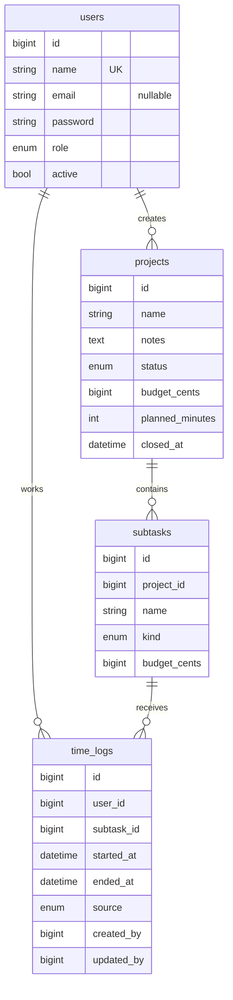

# Project time pilot — technical specification

Version 1.0. This is the build contract for the pilot quoted at 120 hours. The client tests this version, then changes are quoted again.

Working UI name: **Controle de projetos**.

## 1. What this version is

A responsive web app on the client's domain. People at a plastics plant log shop time against project subtasks, and leaders keep a budget in Brazilian reais next to a planned number of hours.

Three roles:

| Role | Job in this version |
|---|---|
| Admin | Users, projects, subtasks, every time log, reports. |
| Leader | Projects, subtasks, every time log, reports, and users. Can edit an existing time log the same way an admin does. Can create and edit leaders and operators, including turning an account off. Cannot create or edit an administrator. |
| Operator | Start and stop their own timer. Add an internal subtask. |

One company, one site. Interface in Brazilian Portuguese. Money in BRL. Clock and calendar in `America/Sao_Paulo`.

## 2. Stack

| Layer | Choice |
|---|---|
| App | Laravel 13, PHP 8.4 (o módulo que o Apache desta máquina já carrega) |
| UI | Blade e CSS próprio em `public/css`. Sem Node e sem Tailwind no piloto, para o Apache servir o app sem etapa de build |
| Database | MySQL já instalado na máquina (aqui é o 9; o driver do Laravel fala com 8 e 9) |
| Sessions | Driver `database` |
| Local | Apache 2.4 desta máquina, virtual host com `DocumentRoot` em `public/`. Sem Docker |
| Produção | O mesmo arranjo: Apache, PHP 8.4, MySQL, HTTPS no domínio do cliente |

O `php` do PATH nesta máquina pode ser 8.5. Artisan, Composer e testes usam o binário do PHP 8.4, o mesmo major que o Apache executa.

HTML renderizado no servidor é requisito. As telas do operador são views separadas. Essas views não recebem orçamento, horas previstas, totais lançados, custo-hora nem o ponto de outra pessoa. Esconder coluna com CSS não atende esta spec.

Sem SPA, sem API pública, sem websockets, sem Redis, sem filas. O piloto não precisa disso.

Idioma: interface, validação e comentários de código em português. Nomes de classes, métodos, colunas e variáveis ficam em inglês, alinhados ao Laravel e a este modelo de dados. Rotas públicas ficam em português, como na seção 11.

## 3. Out of scope

Leave these out of the codebase, including as unused tables:

- Offline or flaky-network clock
- Hourly labor rate, and any formula that turns hours into reais
- Assigning an operator to a project
- Approval of time logs
- Email, password-reset mail, WhatsApp, push
- Machines, molds, maintenance, inventory
- Native apps
- More than one company or plant
- A second language
- Audit log beyond `created_by` / `updated_by` on time logs
- Self-registration and a profile screen

Hosting is the client's account. This spec includes putting the app on their server. It does not include the monthly server bill.

## 4. Access

Session login with a name chosen from the list of active users, plus a password. No public signup. Inactive users are left off the list and cannot log in.

Admin creates every user and sets the password. Minimum password length is 4 characters. Name is required and unique, ignoring letter case, and it is how the person is picked at login. Email is optional. A filled email is still unique. A user is `active` or not.

Deactivating a user who has an open timer stops that timer at the server's current time and records the admin as `updated_by`.

Logout does not stop a timer. The open row stays open until someone stops it. Session lifetime is 12 hours so a shift does not expire mid-job. When the operator signs in again, the open timer is still there.

There is no "forgot password" flow. The admin sets a new password.

Seed the pilot with one admin, one leader, two operators, two open projects, one closed project, a mix of internal and third-party subtasks, a handful of finished logs, and one timer left running.

## 5. Data model

Store money as integer cents. Store durations as timestamps and compute minutes in queries. Never store a float for reais or hours.

```mermaid
erDiagram
    users ||--o{ time_logs : works
    users ||--o{ projects : creates
    projects ||--o{ subtasks : contains
    subtasks ||--o{ time_logs : receives
    users {
        bigint id
        string name UK
        string email "nullable"
        string password
        enum role
        bool active
    }
    projects {
        bigint id
        string name
        text notes
        enum status
        bigint budget_cents
        int planned_minutes
        datetime closed_at
    }
    subtasks {
        bigint id
        bigint project_id
        string name
        enum kind
        bigint budget_cents
    }
    time_logs {
        bigint id
        bigint user_id
        bigint subtask_id
        datetime started_at
        datetime ended_at
        enum source
        bigint created_by
        bigint updated_by
    }
```

### users

| Column | Rules |
|---|---|
| `name` | Required, 2–120 characters, unique. This is the login identity. |
| `email` | Optional. Unique when filled. |
| `password` | Hashed |
| `role` | `admin`, `leader`, or `operator` |
| `active` | Default true |
| `hourly_rate_cents` | Optional valor hora, in cents. Blank stays empty. The current rate is used for every log, including ones already finished. |
| `shift_start`, `shift_end` | Optional jornada, typed and stored as 24-hour `HH:MM` (`00:00` is midnight, `18:00` is 6 PM). Both empty, or both filled. Weekdays only. |
| `shift_afternoon_start`, `shift_afternoon_end` | Optional second window, after the first one ends. Empty means the day is one span, so lunch sits inside it. |

### projects

| Column | Rules |
|---|---|
| `name` | Required, 2–160 characters |
| `notes` | Optional, max 2000 characters |
| `status` | `open` or `closed`. Default `open` |
| `budget_cents` | Optional on the form. A blank value is stored as 0. Integer, ≥ 0. This is the project budget. It is not a sum of anything else. |
| `planned_minutes` | Required, integer, ≥ 0. Planned hours stored on the project itself. Displayed planned hours are this number plus the sum of every subtask's `planned_minutes`. Subtask hours add; they do not subtract from a pool. |
| `closed_at` | Set when status becomes `closed`. Cleared on reopen. |
| `created_by` | User id |

Closing keeps every subtask and every log. A closed project accepts no new subtasks and no new logs.

Deleting a project asks in the app popup, not the browser. The person must check **Apagar o projeto e todos os lançamentos** and then confirm. That removes the project, its tasks, and every time log on those tasks. A subtask can be deleted only when that subtask has no logs.

### subtasks

| Column | Rules |
|---|---|
| `project_id` | Required. Project must be open to create. |
| `name` | Required, 2–160 characters. Unique inside the project, ignoring spaces at the ends and letter case. The same name on another project is fine. |
| `kind` | `internal` or `third_party` |
| `budget_cents` | Valor previsto, in cents. Required and ≥ 0 when `kind` is `third_party`. Optional for an internal subtask. |
| `planned_minutes` | Tempo previsto for this subtask. Optional. Empty until someone fills it in. |
| `realized_cents` | Valor realizado typed in reais and stored as cents. Optional. This is the material (or any amount typed by hand). It stays. Labor is added beside it from the logs. |
| `alert_percentage` | Optional integer 1–100. |
| `alert_enabled` | Set from the percentage field. A filled percentage turns the alarm on. A blank field turns it off and clears the percentage. |
| `is_revision` | Checkbox. When on, the subtask is rework, usually Labone's own clocked time caused by a third party. |
| `revision_notes` | Optional description for any subtask. Stays when the revision box is off. Blank clears it. |
| `revision_of_subtask_id` | Optional link to a third-party subtask on the same project, so revisions can be totaled per outside crew. Cleared when the box is off. |
| `created_by` | User id |

An internal subtask is what people clock. A third-party subtask never receives a time log. Changing `kind` after logs exist is rejected. Changing a third-party subtask to internal is allowed only while it has no logs.

Tempo realizado is the sum of finished logs on that subtask. Open timers do not count there. Valor realizado on the task is the typed amount plus labor. Labor is that task's minutes, including the open clock, times each person's current valor hora, rounded to cents. A person with no rate adds nothing. When both parts are above zero the screen shows them side by side, like `R$ 1.000,00 + R$ 1.000,00`. One part alone shows that amount. Neither shows "—". The project total is the sum of those task totals. Operators never see the rate or these amounts.

An alert is reached only when `alert_enabled` is true, `planned_minutes` is greater than zero, and consumed minutes × 100 is at least `planned_minutes` × `alert_percentage`. Consumed minutes are finished logs plus the open clock on that same subtask. Reached alerts show on the admin and leader Alertas page, with the project name, the subtask name, and the percentage.

Operators may create subtasks. The server forces `kind = internal` and leaves planned time, both money fields, and the alert empty on that path. The operator form has a name field and nothing else.

Copying a project asks for a new name and duplicates notes, the project budget and planned hours, and every subtask with its planned time, valor previsto, alert, and revision flag, notes, and third-party link (pointing at the copied third-party row). It does not copy time logs or valor realizado. The copy opens as a new project.

### time_logs

| Column | Rules |
|---|---|
| `user_id` | The person whose time it is |
| `subtask_id` | Must be an internal subtask on an open project at the moment of create |
| `started_at`, `ended_at` | Stored in UTC. `ended_at` null means the timer is open. When both are set, `ended_at` is after `started_at`. |
| `source` | `timer` or `manual` |
| `created_by`, `updated_by` | Who wrote the row. For an operator timer these are the operator. For a manual row these are the admin. |

Database constraints:

- A person may have several open logs, one per subtask. A second open log on the same subtask for the same person is refused.
- Overlapping intervals for the same person are allowed, because two tasks can run at once.

There is no overlap check on create or update.

`source` does not change after insert. Editing a timer row keeps `source = timer`.

Duration in minutes is `TIMESTAMPDIFF(MINUTE, started_at, ended_at)`. Finished totals on lists stay closed logs. Alerts and the project sheet add the minutes already elapsed on open logs.

## 6. Permissions

Enforce these on the server for every route, not only in the navigation. A forbidden URL returns 403.

| Action | Admin | Leader | Operator |
|---|---|---|---|
| Sign in | Yes | Yes | Yes |
| Manage users | Yes | No | No |
| Open reports and CSV | Yes | Yes | No |
| Set a subtask alert (percentage and on/off) | Yes | Yes | No |
| See reached alerts on the home screen | Yes | Yes | No |
| Change project or subtask planned hours | Yes | No | No |
| Change a third-party budget | Yes | No | No |
| Start or stop a timer for any active person | Yes | Yes | No |
| Copy a project | Yes | Yes | No |
| Create, edit, close, reopen projects | Yes | Yes | No |
| Delete a project and its time logs, after the checkbox | Yes | Yes | No |
| Delete a user account that has no time logs | Yes | No | No |
| See budgets, planned hours, logged totals | Yes | Yes | No |
| Create a third-party subtask | Yes | Yes | No |
| Edit or delete a subtask | Yes | Yes | No |
| Create an internal subtask | Yes | Yes | Yes |
| Start and stop their own timer | Yes | Yes | Yes |
| See every open timer | Yes | Yes | Own timer only |
| Create a manual time log | Yes | No | No |
| Edit or delete a time log | Yes | Yes | No |
| List historical logs | Yes | Yes | No |

Any active user may clock any internal subtask of any open project. There is no assignment table.

Operator HTTP responses, including validation errors, must not echo a budget, a planned-hour figure, a summed duration, or another person's name on a timer.

## 7. Time rules

Server time is the only clock that writes `started_at` for a timer. The browser clock is never stored.

**Start.** `POST` with a subtask id. Admin and leader may also send a user id, and the clock opens for that active person. An operator's post always opens their own clock.

- Caller is authenticated and active.
- The person the clock is for is active.
- Subtask is internal and its project is open.
- That person does not already have an open log on this same subtask.
- Insert `started_at = now()`, `ended_at = null`, `source = timer`.

A second open log on a different subtask is allowed. If the subtask is third-party or the project is closed, refuse.

**Stop.** Stops one open log, identified by id. Set `ended_at = now()`. If `ended_at` is not after `started_at`, move it one second past the start. An operator can stop only their own open log. Admin and leader can stop any open log. If they have no matching open log, refuse.

Operators have no other time-log actions. They never send a start time or a duration.

**Manual log.** Admin creates. Admin and leader edit and delete. Leaders can read the list.

- Required: user, internal subtask, start, duration as decimal hours (`1,5` and `1.5` both mean 90 minutes).
- The project must be open.
- Duration is greater than zero. The stored end is the start plus that duration.
- That end is not in the future. Start may be in the past.
- Overlap with another log of that same user is allowed.
- `source = manual`.

Edit uses the same checks. Delete is a hard delete. The pilot has no trash.

Leaders and admin may start a timer for themselves or for any active person, and they may stop any open timer. Manual entry is how they fix an operator's day.

## 8. Screens

Navigation shows only the links that role can open.

Sharing the address shows the title **Controle de projetos**, the line "O ponto da fábrica, no molde certo. Acompanhe horas, tarefas e orçamento de cada projeto.", and the Laravel mark at `/og.png`.

Phone layout is a single column below 768px. Below that width the top links, the signed-in name, and **Sair** sit behind a hamburger button so the bar stays on the screen. The operator's open timer, when they have one, stays at the top of the home screen with a full-width **Parar** button. Admin tables scroll sideways on a phone. That is enough. The clock flow is the one that has to feel obvious on a phone.

### Entrar

A select of active user names, password, submit. Wrong password, an unknown person, or an inactive account all answer "Não foi possível entrar."

### Início

Admin and leader see two columns. The left column is **Projetos em andamento**, then **Iniciar ponto**. The right column is **Pontos em andamento**. That person's own open clocks sit at the top of the page, stacked one under another. A shorter widget does not push the one beside it down. On a phone the columns stack.

### Alertas

Admin and leader. The nav item sits after Início. It shows `(N)` for unresolved jornada gaps and reached percentage alerts this person has not opened yet. A gap that already has a start time does not count. Opening Alertas marks the current set as read for that person only, and the number drops to nothing until a new one appears.

**Jornada.** Weekdays in São Paulo, and only inside a person's shift. A single span (07:00–17:00) alerts through lunch. A second span (07:00–12:00 and 13:00–17:00) leaves the gap between them quiet. Someone with no shift produces no row. A row appears when 15 minutes pass with no clock in that window. "Desde" is the window start if they have not worked in it yet, or the end of their last log. Starting a clock adds "Iniciou às HH:MM" on that same row. A later gap of 15 minutes is a new row. On open, the page shows only the current São Paulo day, including a window that ended with nobody starting. Rows are grouped under the date `dd/mm/yyyy`, newest day first, and inside each day the latest time is first. **Carregar dias anteriores** adds the next five earlier days that have rows, then five more on each click, and hides when the 30-day window is fully shown. A refresh shows only the current day again. Days before that person's account existed are left out. Opening the page marks every current alert as read for that person, including jornada days that are not on screen yet, and the nav count drops to nothing until a new one appears. Empty state: "Ninguém parado na jornada."

**Alertas atingidos** lists every subtask whose alarm is on and whose consumed hours (finished plus the open clock on that subtask) have reached that subtask's percentage. Each row shows project, subtask, percentage, and consumed hours against that subtask's planned hours. Empty state: "Nenhum alerta atingido." Operators get 403.

**Projetos em andamento.** Open projects only.

- Admin and leader see, per project: name, budget, planned hours, hours logged so far (all finished logs, not date-filtered), and the sum of third-party subtask budgets. Each row links to the project.
- Operator sees the project name only. The row links to a start screen for that project.

**Right — Pontos em andamento.**

- Admin and leader see their own open logs above those regions, each with the same live clock and **Parar** an operator gets. **Iniciar ponto** on Início asks for a person and an internal subtask of an open project, then starts that person's clock. The person list defaults to whoever is signed in. **Ponto** on the project page opens the same start screen an operator uses, and that one starts the signed-in person's clock. A revision subtask shows `(revisão)` after its name in those pickers.
- Admin and leader see every open log: operator name, project, subtask, time of day it started, a live clock `HH:MM:SS` driven from `started_at`, and **Parar**. The server prints the current elapsed time, and a script advances the seconds. This region can be empty: "Nenhum ponto em andamento."
- Operator sees each of their own open logs at the top of Início, stacked: project, subtask, the same live clock for that point, "Desde HH:MM", and **Parar**. Each clock is only that open point. It is not the total already spent on the task or the project. No history, no other people. The same clocks appear on the start screen. If they have nothing open: "Você não tem ponto em andamento."

### Projetos

Admin and leader. List with a status filter, default **Abertos**. Columns: name, status, budget, planned hours, logged hours, third-party budget sum.

**Novo projeto** and **Importar** open lightboxes on this page. A validation error reopens that same lightbox.

**Importar** opens a lightbox. The file is a semicolon-separated CSV. Column three of the first row is the project name. From the third row on, column three is an internal task name. Other cells are ignored. The project is created open, with budget and planned hours at zero. Duplicate task names in the file are kept once.

Create and edit form:

- Nome
- Observações
- Orçamento (R$), input with Brazilian grouping, stored as cents
- Horas previstas, decimal hours typed with a comma or a dot (`1,5` and `1.5` both mean 90 minutes), stored as minutes, rounded to the nearest minute. On edit, only an admin can change this number. A leader still sets it when creating the project.
- Salvar

Actions on a row: edit, close, reopen, and delete. Delete confirms in the app popup. A project delete also requires the checkbox that removes its time logs. A task delete is offered only when that task has no logs.

Operators have no project list route. They reach open projects from Início.

### Projeto

Admin and leader see the project header with planned hours as the project field plus the tasks, then two groups of tasks. The project name opens the edit form. One **...** button opens Editar, Ponto, Relatório, Copiar, Encerrar or Reabrir, and Apagar. **Editar** is the same form: name, notes, budget, and planned hours. A leader sets planned hours when creating the project. After that, only an administrator can change them, including a project that arrived from CSV with zero hours. **Ponto** on an open project opens the same start screen the operator uses. **Relatório** opens the project sheet.

Internal tasks: name, tempo previsto, tempo realizado, valor previsto, valor realizado, and the alarm. Clicking the row opens a lightbox on this page. Delete stays on the row when the task has no logs, and is hidden when logs exist.

Third-party subtasks: the same columns except tempo realizado, because that row never gets a clock.

On an open project, each group has one button under the table: **Adicionar tarefa** or **Adicionar equipe terceira**. The button opens a lightbox with the same fields as editing: name, tempo previsto, valor previsto, valor realizado, alarm, and revision. A leader can set tempo previsto and the third-party valor previsto when creating. After that, only an admin can change those two. The separate edit page remains for a direct link.

**Copiar** asks only for the new name.

Operator project screen, reached from Início: project name as a heading, then internal tasks, each with **Iniciar**, or **Parar** when that task is already running for them. Other open clocks stay visible above the list, each with its own **Parar**. Third-party rows are omitted. No hours, no money. At the bottom, a single field **Nova tarefa** and a save button. Starting a second task does not require stopping the first.

### Lançamentos

Admin and leader. Filter by project, user, month, and a date range on `started_at`. Default is the current month in São Paulo, and the heading names it, like **Outubro de 2026**. Choosing another month jumps to that month. A custom De/Até range changes the heading to **Período selecionado**.

Columns: operator, project, task, start, duration as `Hh MMmin`. The end is not shown. It is the start plus the duration.

**Novo lançamento** is admin only and stays on its own page. Admin and leader open an existing row in a lightbox on this page: person, task, start, and duration as decimal hours. A validation error reopens that same lightbox. **Apagar** stays on the row, asks in the app popup, and is available to admin and leader.

Open logs appear in this list with duration shown as "Em andamento".

### Relatórios

Admin and leader. One page, two blocks, all finished time. Open logs are left out. The page says so. **Por projeto** has a text search on the project name and a status select: Todas, Aberto, Encerrado. **Exportar tudo** under that block downloads the rows that match those filters.

**Por projeto.** One row per project. Columns:

- Projeto
- Status
- Orçamento (R$) — the stored project budget
- Horas previstas — the project plan plus subtask plans
- Horas lançadas — finished logs, all time
- Orçamento de terceiros (R$) — current sum of third-party subtask budgets

**Por operador.** One row per user who has finished logs. Columns: name, role, hours, and hours per project.

A project row opens that project's printable sheet: equipe interna, equipe terceira, revisões, and the totals. **Exportar** and **Imprimir** sit together at the bottom. Print uses the browser and prints that sheet; the buttons themselves stay off the paper. A person row opens that person's sheet at `/relatorios/pessoas/{id}`: hours already finished, grouped by project and subtask, with a revision marked `(revisão)`. Optional De and Até filter that sheet. Empty dates cover all time. A filled date is a São Paulo day, inclusive, matched on `started_at`. **Exportar** and **Imprimir** sit together at the bottom of that sheet too. **Exportar tudo** under the operator block downloads every person, with no date limit.

- `projetos.csv` — the whole project block. One project, when `project_id` is set, downloads as that project's name plus `.csv`
- `pessoas.csv` — the whole operator block. One person, when `user_id` is set, downloads as that person's name plus `.csv`. Columns: nome, papel, horas, then one column per project that appears in the file. The cell is that person's finished hours on that project, `0,00` when they have none.

CSV is UTF-8 with BOM, field separator `;`, so Excel in Portuguese opens it in columns. Hours as decimal with a comma, two places (`1,50`). Money as decimal with a comma, two places, no currency symbol.

Each project also has a sheet at `/projetos/{id}/relatorio`. The footer shows planned hours (project plus subtasks), realized hours including open clocks, planned money (project plus subtasks), and realized money: what was typed on the tasks plus labor from the valor hora. Revision subtasks are left out of the two team tables and listed only under Revisões. Each third-party row still shows how many revisions point at it. **Exportar** and **Imprimir** sit at the bottom of the sheet. Export downloads `{project name}.csv`: UTF-8 with BOM, separator `;`, hours and money as decimals with a comma. There is no PDF engine. Print is the browser print of the same sheet.

### Usuários

Admin and leader. Name, optional email, role, active, optional valor hora, password on create, optional new password on edit. With no jornada, the form shows **Jornada** and, under it on the left, **Adicionar jornada**. Each click reveals one pair of times, up to two, labeled **Jornada 1** and **Jornada 2**. A saved jornada is already open. **Remover** clears that pair. **Arquivar**, in the edit lightbox, turns the account off and closes any open clock. The person leaves the login list and moves to **Usuários arquivados** under the main list. Hours already logged stay on the tasks. Opening an archived person shows **Reativar**, which brings the account back. Next to **Arquivar** or **Reativar**, an administrator sees a red **Apagar** link. It asks in the app popup, then removes the account. Projects and tasks that person created stay, and the administrator who confirmed becomes their author. A person who already has time logs is not deleted: the hours stay, and the message says to archive instead. An administrator cannot delete their own account, and the last active administrator stays. A leader does not see **Apagar**. The edit lightbox has no **Conta ativa** checkbox. A leader can archive or reactivate a leader or an operator. Only an admin can archive or reactivate an administrator, and the last active administrator stays. A leader can set the rate and the shift. Without them, the person keeps today's behavior: no idle alert and no labor cost. Role labels: Administrador, Líder, Operador. A leader can assign Líder or Operador. **Novo usuário** opens a lightbox on this page. Clicking a row opens that person’s edit form in a lightbox when the signed-in user is allowed to change them. A validation error reopens that same lightbox. Only an admin can create an administrator or open an administrator’s edit form.

## 9. Validation copy

Return the message in Portuguese next to the field.

| Case | Message |
|---|---|
| Bad login | E-mail ou senha inválidos. |
| Same subtask already running | Esta tarefa já está em andamento. |
| Third-party or closed | Este item não aceita ponto. |
| Duration is zero | A duração precisa ser maior que zero. |
| Duration would end in the future | A duração não pode passar do momento atual. |
| Duration is not a number of hours | Informe a duração em horas, como 1,5. |
| Revision linked to the wrong row | A revisão precisa apontar para uma equipe terceira deste projeto. |
| Delete a subtask that has logs | Este item tem lançamentos. Encerre o projeto em vez de apagar. |
| Delete a project without the checkbox | Marque a confirmação para apagar o projeto e os lançamentos. |
| Delete a user who has time logs | Esta pessoa tem lançamentos. Arquive a conta em vez de apagar. |
| Operator hits a leader URL | 403 page: Você não tem acesso a esta página. |

## 10. Formatting

| Item | Rule |
|---|---|
| Time zone | Store UTC. Parse and display `America/Sao_Paulo`. |
| Money on screen | `R$ 1.234,56` |
| Hours on screen | `2h 05min` from whole minutes |
| Hours in CSV | Decimal comma, two places |
| Empty totals | `0h 00min` and `R$ 0,00` for admin and leader. Operator screens do not render these at all. |

Planned hours and a time-log duration are edited as a decimal hour value (`1,5` and `1.5` both mean 90 minutes). Everywhere else, people read `Hh MMmin`.

## 11. Routes

| Method | Path | Roles |
|---|---|---|
| GET, POST | `/entrar` | guest |
| POST | `/sair` | any |
| GET | `/` | any |
| GET, POST | `/usuarios` | admin, leader |
| PUT | `/usuarios/{user}` | admin, leader |
| GET, POST | `/projetos` | admin, leader |
| GET, PUT | `/projetos/{project}` | admin, leader for manage; operator GET is the start screen at `/projetos/{project}/ponto` |
| POST | `/projetos/{project}/encerrar` | admin, leader |
| POST | `/projetos/{project}/reabrir` | admin, leader |
| DELETE | `/projetos/{project}` | admin, leader |
| POST | `/projetos/{project}/subtarefas` | any, with the operator restrictions in section 5 |
| PUT, DELETE | `/subtarefas/{subtask}` | admin, leader |
| GET | `/projetos/{project}/relatorio` | admin, leader |
| GET | `/projetos/{project}/relatorio.csv` | admin, leader |
| GET | `/projetos/{project}/ponto` | any |
| POST | `/ponto/iniciar` | any |
| POST | `/ponto/parar` | any |
| GET | `/lancamentos` | admin, leader |
| POST | `/lancamentos` | admin |
| GET, PUT | `/lancamentos/{timeLog}` | admin, leader |
| DELETE | `/lancamentos/{timeLog}` | admin, leader |
| GET | `/relatorios` | admin, leader |
| GET | `/relatorios/pessoas/{user}` | admin, leader |
| GET | `/relatorios/projetos.csv` | admin, leader |
| GET | `/relatorios/pessoas.csv` | admin, leader |

Operator `GET /projetos` redirects to `/`.

## 12. Security

- HTTPS only. Redirect HTTP to HTTPS.
- CSRF on every form.
- Login throttled: 5 attempts per chosen user per minute.
- Passwords hashed with the framework default.
- Policies: `UserPolicy`, `ProjectPolicy`, `SubtaskPolicy`, `TimeLogPolicy`. Reports use a gate `viewReports` that is true only for admin.
- Mass assignment cannot set `role`, `budget_cents`, `kind`, or `source` from an operator request.
- Errors in production hide stack traces.
- `.env` stays off the server git checkout and out of the repo.

## 13. Deploy

Local, nesta máquina:

- Apache já em execução, PHP 8.4 via `mod_php`, MySQL já em execução
- Virtual host `labone.localhost` com document root em `public/`
- Banco `labone`, usuário local do MySQL. Credenciais só no `.env`, que não entra no git
- Sem Docker

Produção, no servidor do cliente, segue o mesmo desenho:

- Apache, PHP 8.4 com as extensões usuais do Laravel, MySQL
- Certificado HTTPS no domínio deles
- Usuário do sistema que não seja root, document root em `public/`
- `APP_ENV=production`, `APP_DEBUG=false`, `APP_TIMEZONE=America/Sao_Paulo`, `APP_LOCALE=pt_BR`
- Sessão e cache em banco
- `mysqldump` diário, retenção de 7 dias na mesma máquina
- Publicação: `git pull`, `composer install --no-dev`, `php artisan migrate --force`, cache de config e views

Entregar ao cliente uma nota curta em português: como entrar, o que cada papel faz, e que o administrador redefine senhas. A senha inicial do administrador vai por um canal fora do git.

## 14. Tests that define done

Feature tests, hitting the real routes:

1. Operator receives 403 on `/usuarios`, `/lancamentos`, `/relatorios`, and both CSV URLs.
2. Leader can open `/usuarios`, create a leader or operator, and turn that account off. Leader receives 403 when editing an administrator, and cannot assign the administrator role. Leader can edit or delete an existing time log and receives 403 on creating one. Leader can open `/relatorios`.
3. Operator HTML for `/` and `/projetos/{id}/ponto` does not contain the project's budget, planned hours, or any logged total. Build the fixture with a distinctive amount such as `R$ 9.876,54` and assert it is absent.
4. Operator cannot post a manual log, a third-party subtask, or a project.
5. A second start on a different subtask succeeds. A second start on the same subtask fails and leaves the first open row.
6. Start on a third-party subtask fails. Start on a closed project fails.
7. Overlapping manual logs for the same user are stored.
8. Deactivating a user closes their open timer.
9. Logout leaves an open timer open.
10. Project and subtask delete fails when a log exists, and succeeds when none exist.
11. Admin CSV is semicolon-separated, starts with a BOM, and omits open logs.
12. A log started at 23:30 São Paulo falls on that local date, not the UTC date.

Then a manual pass on a phone-width browser and on a desktop browser, once as each role: start, stop, add a subtask as the operator, fix that log as the leader, read the report as the admin.

## 15. Build order

1. App skeleton, auth, users, roles, deploy to a staging URL early.
2. Projects and subtasks, including close, reopen, and the delete guard.
3. Timer start and stop, one-open constraint, operator views with the fixture assertion from test 3.
4. Manual logs, overlap checks, lançamentos screens.
5. Home widgets for each role.
6. Reports and CSV.
7. Seed data, phone pass, production domain, handover note.

Do not start reports before the operator views are proven empty of totals. That rule is the one a later refactor is most likely to break.
